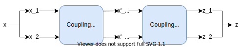

# Real NVP Networks

	

		
		

			<a href="homepages.ucl.ac.uk/~ucacasz/">Alejandro Sztrajman</a>
			 
			University College London
		

	

Real NVP networks are generative models especifically designed to encode invertible transformations. They provide efficient sampling and exact probability density evaluation, which can be leveraged for unsupervised learning of high-dimensional distributions through maximum likelihood estimation. 
In this article, we will summarize the original paper by <a href="https://arxiv.org/abs/1605.08803">Dinh et al.</a>1

Real NVP networks are designed to encode an invertible mapping between elements from two probability distributions, and provide a simple way to compute its inverse. In the simple 1D example of the diagram, the network transforms samples $x$, which follow a complex distribution $p_X(x)$, into $z$ values following a simple Gaussian distribution $p_Z(z)$. This transformation $x \rightarrow z$ can be expressed as a function $z = f(x)$, encoded by the network. The architecture allows us to perform the transformation in the opposite direction $z \rightarrow x$, effectively providing the inverse function $x = f^{-1}(z) = g(z)$.

This two-side transformations can be used to create a <i>random number generator</i> of the arbitrary distribution $p_X$, simply by drawing samples from a Gaussian $p_Z$ and transforming them into $x$ samples. As we will see, the training of the RNVP network can be done simply with samples of $x$, without requiring knowledge of the underlying distribution $p_X$. For higher-dimensional data, such as images, this can be leveraged to learn an unknown distribution from unlabeled samples, and enable the creation of new unseen images from the same distribution.

#### Network Architecture

Real NVPs are composed of <i>coupling layers</i>, which perform invertible operations. The combination of these invertible layers results in an overall invertible transformation encoded by the network. In practice, the architecture is designed to allow evaluations in both directions; that is, we can compute $z = f(x)$ and its inverse $x = g(z) = f^{-1}(z)$ with the same RNVP network.

We'll analyze the implementation of a RNVP model for the simple case of a 2-dimensional input. As shown in the Figure, the transformation from $\mathbf{x}$ to $\mathbf{z}$ is obtained by splitting the input and applying invertible operations alternatingly to each component.

In the first coupling layer, $x_1$ is left unchanged and $x_2$ is transformed as follows:
$$
\large{
\label{eq:fore}
x'_1 = x_1\\
x'_2 = x_2 e^{s(x_1)} + t(x_1)
}
$$
Where $s$ and $t$ are arbitrary functions, in this case from $R$ $\rightarrow$ $R$. In practice, we will use neural networks to encode these functions, and their weights will be determined during the RNVP training. Equation $\ref{eq:fore}$ gives place to an overall invertible transformation, with the following inverse, which can be used to implement the evaluation of the RNVP network in the opposite direction (from $\mathbf{z}$ to $\mathbf{x}$): 
$$
\large{x_1 = x'_1\\
x_2 = \frac{x'_2 - t(x_1)}{e^{s(x_1)}}
\label{eq:back}}
$$

###### For inputs of higher dimensionality, the split of $x$ into $x1$ and $x_2$ can be done arbitrarily. In practice, this is implemented using 2 complementary binary masks.

However, the transformation provided by the first coupling layer lacks flexibility, since it leaves $x_1$ unchanged. The solution is to apply a second complementary coupling layer, which now transforms $x'_1$ and leaves $x'_2$ unmodified:
$$
\large{z_1 = x'_1 e^{s'(x'_2)} + t'(x'_2)\\
z_2 = x'_2
\label{eq:fore2}}
$$
with new functions/networks $s'$ and $t'$. Gathering equations $\ref{eq:fore}$-$\ref{eq:fore2}$ we can implement the evaluation of the RNVP network in both directions: $\mathbf{z} = f(\mathbf{x})$ and $\mathbf{x} = g(\mathbf{z})$.

#### Density Estimation and Training

During a typical training, the RNVP network learns to map samples $z$ from a known simple probability density $p_Z(z)$, usually a Gaussian distribution, to $x$ samples from an unknown distribution $p_X(x)$. Once the training is complete, we can generate new unseen samples from the $p_X$ distribution by drawing random samples from $p_Z$ and transforming them with the RNVP.  The diagram illustrates the transformation of 2D samples from a Gaussian $p_Z$ to a distribution $p_X$ in the shape of two moons.

The mapping between the two probability distributions responds to the [change of variable formula](https://en.wikipedia.org/wiki/Probability_density_function#Function_of_random_variables_and_change_of_variables_in_the_probability_density_function), which follows from the conservation of the probability in a differential area. For univariate distributions, this can be expressed as:
$$
\large{|p_X(x)dx| = |p_Z(z)dz| \qquad\rightarrow\qquad p_X(x) = p_Z(z)\left|\frac{dz}{dx}\right| = p_Z(z)\left|\frac{df(x)}{dx}\right|}
\label{eq:prob}
$$
where $f(x)$ is one of two functions encoded by the RNVP network. For multivariate distributions the derivative becomes the determinant of the Jacobian matrix of the transformation:
$$
\large{p_X(x) = p_Z(z)\left|\text{det}\,J\right| = p_Z(z)\left|\text{det}(J_1).\text{det}(J_2)\right|}
\label{eq:prob2}
$$
where we split the computation of the determinant into each coupling layer. For the first coupling layer, the Jacobian matrix is computed as the partial derivatives from equation $\ref{eq:fore}$:
$$
\large{
J_1 =
\begin{bmatrix}
	\frac{\partial x'_1}{\partial x_1} & \frac{\partial x'_1}{\partial x_2} \\
	\frac{\partial x'_2}{\partial x_1} & \frac{\partial x'_2}{\partial x_2}
\end{bmatrix}
=
\begin{bmatrix}
1 & 0 \\
\frac{\partial x'_2}{\partial x_1} & e^{s(x_1)}
\end{bmatrix}
}
$$
with similar results for $J_2$ from equation $\ref{eq:fore2}$. The determinant is easy to compute, due to these matrices being triangular:
$$
\large{
\text{det}(J) = \text{det}(J_1).\text{det}(J_2) = e^{s(x_1)}e^{s'(x_2)}
}
\label{eq:prob3}
$$

###### $p_X(x)$ corresponds to the probability density encoded by the RNVP network. Before training, this PDF will not be related to the <i>actual</i> distribution of the data samples $x$, but its evaluation will still be exact.

Hence, through equation $\ref{eq:prob}$ we obtain a computationally-cheap way of computing $p_X(x)$ if we know $p_Z(z)$, the probability density of its corresponding point in $z$-space. Notice that $p_Z(z)$ is a simple and known distribution, and that given an arbitrary $x$, we can find its corresponding $z$ simply by evaluating the RNVP network: $z = f(x)$. Thus we now have a recipe to compute $p_X(x)$ for any sample $x$.

###### Note that we use $x^{(i)}$ to refer to different samples of $x$. We reserve the notation $x_1$ and $x_2$ for the two branches of input/output of the coupling layers.

The unsupervised training of RNVP networks leverages this capacity to compute the probability density $p_X(x)$ to do maximum likelihood estimation, which seeks to maximize the likelihood $p(x^{(1)}, \ldots, x^{(N)} | \theta)$ of measuring a series of data samples $x^{(i)}$ given the parameters of the model (in this case, the network weights). For independent samples this can be expressed as:
$$
\large{
p(x^{(1)}, \ldots, x^{(N)} | \theta) = \Pi_{i=1}^N p(x^{(i)}|\theta)
}
\label{eq:likelihood}
$$
In practice, the maximization of the likelihood is done by minimizing the loss defined as the negative log likelihood. Gathering equations $\ref{eq:prob2}$, $\ref{eq:prob3}$ and $\ref{eq:likelihood}$, the training loss becomes:
$$
\large{
\begin{align*}
\text{Loss} &= - \text{log}\left(\Pi_{i=1}^N p_X(x^{(i)}|\theta)\right) = -\text{log}\left(\Pi_{i=1}^N p_Z(z^{(i)}|\theta).\text{det}(J^{(i)})\right) \\
            &= -\sum_{i=1}^N \text{log}\left(p_Z(z^{(i)}|\theta)\right) - \sum_{i=1}^N \text{log}\left(\text{det}(J^{(i)}) \right) \\
            &= -\sum_{i=1}^N \text{log}\left(p_Z(z^{(i)}|\theta)\right) - \sum_{i=1}^N \left(s(x^{(i)}_1) + s'(x^{(i)}_2) \right)
            
\end{align*}
}
$$

This expression is easy and fast to compute. For each sample $x^{(i)}$, we can obtain the corresponding $z^{(i)}$ by direct evaluation of the RNVP network, and then compute $p_Z(z^{(i)})$ which is chosen as a standard normal distribution. The second term only requires evaluating the $s$ and $s'$ operations within the coupling layers, which implies a simple inference of their corresponding networks.

### References

[1] L. Dinh, J. Sohl-Dickstein, S. Bengio (2017). Density Estimation Using Real NVP. <i>International Conference on Learning Representations</i>. 

### Further Reading

* I. Kobyzev, S. Prince, M. Brubaker. (2020). Normalizing Flows: An Introduction and Review of Current Methods. <i>IEEE Transactions on Pattern Analysis and Machine Intelligence</i>. <a href="http://dx.doi.org/10.1109/TPAMI.2020.2992934">10.1109/TPAMI.2020.2992934</a>.
* G. Papamakarios, E. Nalisnick, D. Jimenez Rezende, S. Mohadem, B. Lakshminarayanan (2021). Normalizing Flows for Probabilistic Modeling and Inference. <i>Journal of Machine Learning Research</i> (22), pp 1-64.
*  [Real NVP PyTorch](https://github.com/senya-ashukha/real-nvp-pytorch/blob/master/real-nvp-pytorch.ipynb): A simple and short implementation of Real NVP in only 40 lines of code by [@senya-ashukha](https://github.com/senya-ashukha).
